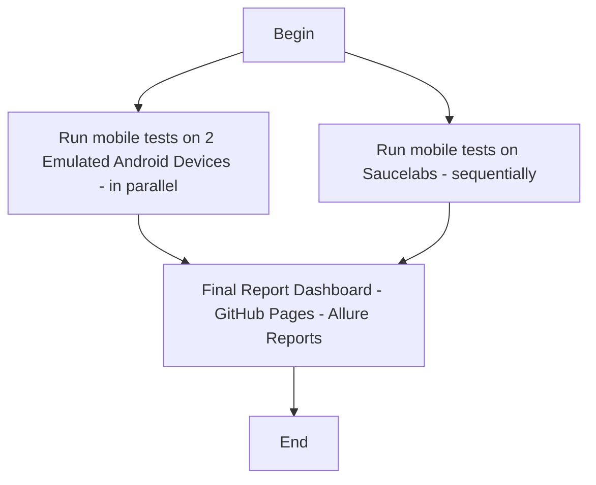

# Project to demonstrate knowledge in Appium + Design Patterns + CI/CD (Github Actions and Pages) + Allure Reports + In parallel mode + SauceLabs

This project demonstrates mobile automation testing using Java, Appium, TestNG, and Allure Reports. It is configured to run locally on real Android devices and in the cloud on SauceLabs infrastructure.

The main goal of this project is to automate a suite of tests covering both positive and negative scenarios for the Google Calculator application.

[](https://github.com/clark-ewerton/mobile-test-automation-lab/actions/workflows/cicd.yml)
[](https://clark-ewerton.github.io/mobile-test-automation-lab/)


# ⭐ If you find this project useful, please consider giving it a star to help increase its visibility.
---

# 📋 Table of Contents

- [📱 Project Overview](#about-the-project)
- [Technologies and Patterns Used](#technologies-and-patterns-used)
- [Folder Structure](#folder-structure)
- [Pre-requirements](#pre-requirements)
- [Setup](#setup)
- [Running the Tests](#running-the-tests)
- [Test Reports](#test-reports)
- [Running on GitHub Actions](#running-on-github-actions)
- [Execution Observations](#execution-observations)
- [Contributing](#contributing)
- [📄 License](#license)

## 📱 Project Overview

This project provides a complete and extensible structure to automate tests for Android applications. It includes local and remote (cloud) execution flows, automated report generation, and integration with GitHub Pages.

### What'll be run?

The idea was to create a suite of automated tests that covers some positive and negative scenarios of a `Google Calculator`. Scenarios covered:

#### 📋 Test Scenarios Covered

This project covers the following automated test scenarios on the Google Calculator:

| Type       | Operation          | Inputs             | Expected Result                               |
|------------|---------------------|--------------------|-----------------------------------------------|
| Positive   | Add                 | 2, 3               | 5                                             |
| Positive   | Add                 | 2, 3, 4            | 9                                             |
| Positive   | Subtract            | 10, 3              | 7                                             |
| Positive   | Multiply            | 3, 4               | 12                                            |
| Positive   | Divide              | 10, 2              | 5                                             |
| Positive   | Percentage          | 100, 10            | 10                                            |
| Positive   | Subtract            | 3, 10              | -7                                            |
| Positive   | Multiply            | 0, 10              | 0                                             |
| Positive   | Divide              | 7, 2               | 3.5                                           |
| Positive   | Add                 | -5, 3              | -2                                            |
| Positive   | Multiply            | 2, 3, 4            | 24                                            |
| Positive   | Percentage          | 0, 50              | 0                                             |
| Positive   | Percentage          | -200, 10           | -20                                           |
| Negative   | Divide              | 5, 0               | Can't divide by 0                             |
| Negative   | Divide              | 0, 0               | Can't divide by 0                             |
| Negative   | Invalid Operation   | 2, 2               | Invalid Operation                             |
| Negative   | Add                 | (no inputs)        | Invalid Entry                                 |
| Negative   | Subtract            | 5                  | Need at least two numbers to make operation   |
| Negative   | Add                 | A, 5               | Invalid Entry                                 |


---

## 🔧 Technologies Used

- Java 17  
- Maven  
- Appium  
- TestNG  
- Allure Reports  
- GitHub Actions  
- Sauce Labs  

---

## Design Patterns Used

This project follows clean architecture principles and applies several design patterns to improve readability, maintainability, and scalability.

#### 1. Page Object Pattern
Encapsulates page structure and user interactions, promoting reusability and maintainability in UI tests.

- **Example**: [`CalculatorPage.java`](./src/main/java/com/clarkewerton/page_object/CalculatorPage.java)

#### 2. Factory Design Pattern
Responsible for abstracting the creation of driver instances depending on platform and configuration.

- **Example**: [`DriverFactory.java`](./src/main/java/com/clarkewerton/driver/DriverFactory.java)

#### 3. Singleton Design Pattern
Ensures a single instance of critical classes like configuration readers or driver managers.

- **Examples**:
  - [`DriverManager.java`](./src/main/java/com/clarkewerton/driver/manager/AndroidDriverManager.java)

#### 4. Strategy Design Pattern
To select between local and cloud execution.

- **Example**: [`BaseTest.java`](./src/main/java/com/clarkewerton/test/BaseTest.java)

## 📁 Project Structure

```
mobile-test-automation-lab/
├── src/
│ │ └── main/java/com/clarkewerton
│ │ │ │ │ │ └── config/
│ │ │ │ │ │ │ │ ├── Configuration.java
│ │ │ │ │ │ │ │ ├── ConfigurationManager.java
│ │ │ │ │ │ └── driver/
│ │ │ │ │ │ │ │ ├── DriverFactory.java
│ │ │ │ │ │ │ │ ├── IDriver.java
│ │ │ │ │ │ │ │ ├── Platform.java
│ │ │ │ │ │ │ │ └── manager/
│ │ │ │ │ │ │ │ │ │ ├── AndroidDriverManager.java
│ │ │ │ │ │ │ │ │ │ ├── IOSDriverManager.java
│ │ │ │ │ │ └── exception/
│ │ │ │ │ │ │ │ ├── PlatformNotSupportedException.java
│ │ │ │ │ │ └── locators/
│ │ │ │ │ │ │ │ ├── AndroidLocators.java
│ │ │ │ │ │ │ │ ├── IOSLocators.java
│ │ │ │ │ │ └── page_object/
│ │ │ │ │ │ │ │ ├── CalculatorPage.java
│ │ │ │ │ │ └── test/
│ │ │ │ │ │ │ │ ├── BaseTest.java
│ │ │ └── resources/
│ │ │ │ │ ├── log4j2.properties
│ │ │ │ │ └── config/
│ │ │ │ │ │ │── android.properties
│ │ │ │ │ │ │── cloud.properties
│ │ │ │ │ │ │── general.properties
│ │ │ │ │ │ │── ios.properties
│ │ │ └── test/java/com/clarkewerton
│ │ │ │ │ │ └── android/ # Test classes for Android app
│ ││ ││ ││ ││ │ ├── CalculatorTest.java
│ │ │ └── resources/
│ │ │ │ │ ├── testng-cloud.xml
│ │ │ │ │ ├── testng-local.xml
├── .github/workflows/cicd.yml # GitHub workflows (CI, actions)
├── app/googleCalculator.apk # APKs or app-related files
├── target/allure-reports # Generated reports (e.g., Allure)
│ ├── .gitignore
├── pom.xml # Maven configuration
└── README.md

```

## 🧪 Test Execution Modes

This project supports two modes of test execution:

| Mode   | Environment | Parallel Execution | TestNG File           |
|--------|-------------|--------------------|-----------------------|
| Local  | Real devices connected via USB | Yes | testng-local.xml |
| Cloud  | SauceLabs devices | No (Sequential) | testng-cloud.xml |

When triggered by GitHub Actions, both test suites are executed: local tests run in parallel on two devices on Ubuntu, while cloud tests run sequentially on SauceLabs infrastructure.

---

## 🚀 How to Run Tests Locally (Windows)

### Prerequisites

- Java 17 installed  
- Maven installed  
- Android SDK and emulator configured  
- Appium installed and running  

### Steps to run it via real or Emulated devices

```bash
# Clone the repository
git clone https://github.com/clark-ewerton/mobile-test-automation-lab.git
cd mobile-test-automation-lab

# Install dependencies
mvn install -DskipTests

# Start Appium server
appium

# Start the emulator
Please connect your android device into computer (don't forget to enable USB debbuging).
Find your device id by running: adb devices
Copy it
Place it into testng-local.xml, find the line
<parameter name="udid" value="emulator-5554"/>. Replace emulator-5554 by your id.

If you want, please comment the second device block on testng-local file as it won't work tests locally in parallel. Unless you emulate a second device via Android Emulator.

# Upload APK to the device
Please install Google Calculator into your Android device.

# Run TestNG test suite
mvn test -Dsurefire.suiteXmlFiles=src/test/resources/testng-local.xml

# View Allure report
mvn allure:serve
```

### Steps to run it via SauceLabs

```bash
# Clone the repository
git clone https://github.com/clark-ewerton/mobile-test-automation-lab.git
cd mobile-test-automation-lab

# Install dependencies
mvn install -DskipTests

# SauceLabs setup
- Create an account in Saucelabs
- Grab both username and key from your account
- Replace it on [`cloud.properties`](./src/main/resources/conf/cloud.properties)
- Start any android device in Saucelabs
- Don't forget to install googleCalculator.apk

# Run TestNG test suite
mvn test -Dsurefire.suiteXmlFiles=src/test/resources/testng-cloud.xml

# View Allure report
mvn allure:serve
```

## 🧪 GitHub Actions CI/CD
The workflow file `.github/workflows/cicd.yml` includes three jobs:

`run-android-tests-remote`: runs tests on a local emulator on GitHub-hosted runners using Ubuntu.

`run-android-tests-saucelabs`: runs tests in Sauce Labs.

`deploy-report`: generates an Allure report and publishes it to GitHub Pages.

Allure results are stored as artifacts and published after every execution, regardless of test results.

When triggered by a GitHub Actions workflow, tests will be run by the following way:

|Execution Type | Target | Parallelism | TestNG File|
|------------|---------------------|--------------------|-----------------------------------------------|
|Local | Connected Android devices | Parallel | testng-local.xml|
|Cloud | SauceLab Android devices | Sequential | testng-cloud.xml|

See below the flow that the pipeline is doing:



## 📊 Allure Reports
After every test execution, Allure reports are generated and published to:

🔗 https://clark-ewerton.github.io/mobile-test-automation-lab

- 🖼️ **Screenshots:** (only on failure)

## 🌟 Contributing
Contributions are welcome!
Feel free to open issues, fork the repository, and submit pull requests.

If you find this project useful, please consider giving it a star to help increase its visibility.

## 📄 License
This project is licensed under the MIT License.
See the LICENSE file for more details.
